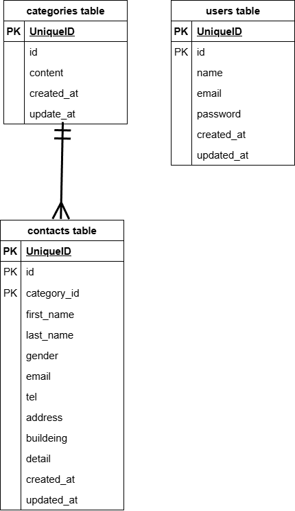

# Contact-form-test

## 環境構築
Dockerビルド

git clone git@github.com:nakahamarikiya2021/Contact-form_Test.git

docker-compose up -d --build

Laravel環境構築

docker-compose exec php bash

composer install

cp .env.example .env

php artisan key:generation

php artisan migrate

php artisan db:seed

## 使用技術
php 8.1

Laravel Framework 8.83.8

mysql:8.0.26

nginx:1.21.1

## ER図

